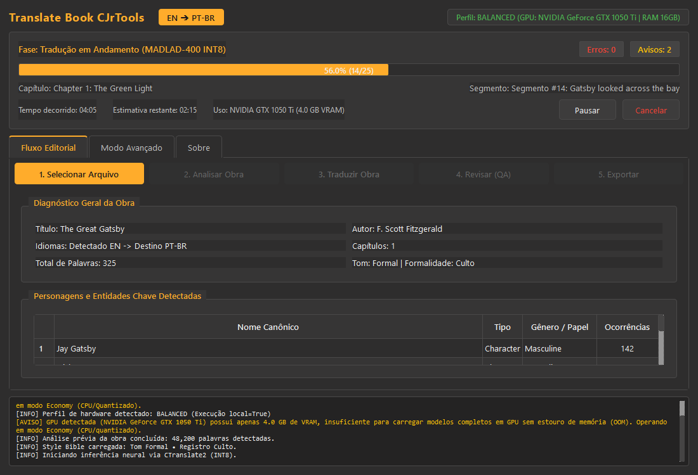
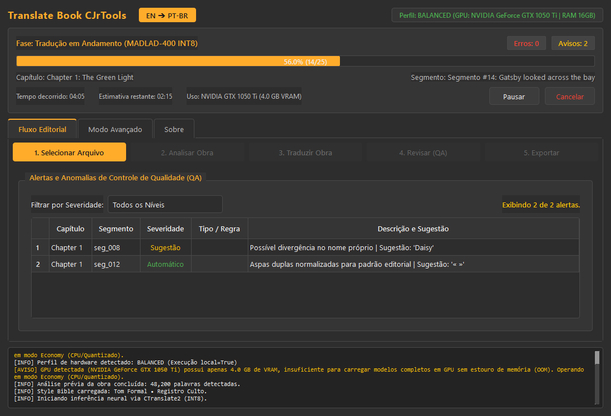
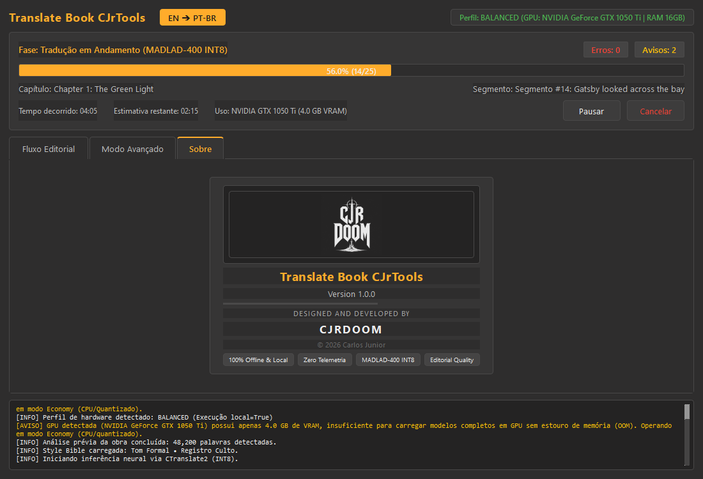

# Translate Book CJrTools — Tradutor Editorial Inteligente de Livros (EN → PT-BR)

[](https://github.com/carlosjrgit/Translate_BooK/actions/workflows/ci.yml)
[](https://www.python.org/)
[](LICENSE)
[](#privacidade-e-processamento-local)
[](#privacidade-e-processamento-local)

Sistema editorial de tradução automática assistida, contextualmente orientada e de alta fidelidade para livros e documentos literários/técnicos em língua inglesa para **Português Brasileiro (PT-BR)**.

---

## Filosofia do Projeto

> **"Modelo competente + Contexto correto + Memória persistente + Regras + Validação + Auditoria."**

O **Translate Book CJrTools** rejeita a abordagem simplista de enviar parágrafos soltos para chatbots generativos em nuvem. A tradução editorial de um livro completo exige muito mais do que capacidade linguística pura: demanda **coerência intercapítulos**, **preservação de nomes próprios e termos travados**, **memória de relacionamentos entre personagens**, **verificação determinística de tags/estilos** e **auditoria contra alucinações**.

Todo o processamento é executado **100% localmente no computador do usuário** utilizando a família de modelos **MADLAD-400** otimizada com a biblioteca de alta velocidade **CTranslate2** em quantização INT8.

---

## Demonstração Visual da Interface

A interface gráfica do **Translate Book CJrTools** foi concebida sob um rigoroso **Design System Dark, Flat, Minimal e Técnico** (fundo `#2E2D2D`, destaque `#FFAC2B`, tipografia *Inter* e *JetBrains Mono*). Seus componentes são inteiramente adaptativos e dinâmicos, garantindo perfeita visualização tanto em modo janela quanto em tela cheia sem qualquer sobreposição de elementos:

### 1. Painel Principal & Fluxo Editorial
Acompanhamento em tempo real de progresso por segmento/capítulo, estimativa de tempo restante (ETA), monitoramento de memória/GPU e resumo diagnóstico da obra (personagens, gênero e total de palavras):



### 2. Auditoria e Controle de Qualidade (QA Alerts)
Tabela interativa de detecção de anomalias com filtros por severidade (*Crítico*, *Sugestão*, *Automático*), verificação de consistência de nomes canônicos e integridade de pontuação editorial:



### 3. Aba "Sobre" (Identidade Oficial CJRDOOM)
Créditos autorais, versão de lançamento e logo oficial em alto contraste com badges técnicas de garantia de privacidade e arquitetura local:



---

## Principais Funcionalidades

- **Formatos de Entrada Suportados**:
  - `TXT` (codificação UTF-8 pura);
  - `DOCX` (Word com preservação de estilos, itálico, negrito, títulos e notas);
  - `EPUB` (reconstrução determinística de estrutura XHTML, ordem de leitura e metadados);
  - `PDF Textual` (extração inteligente de fluxo de leitura sem quebras artificiais de linha);
  - `PDF Escaneado` (módulo opcional de OCR com integração Tesseract).
- **Formatos de Exportação com Integridade Estrutural**:
  - `TXT`, `DOCX` e `EPUB` reconstruídos com nomes seguros e sem nunca sobrescrever o original.
- **Pipeline Editorial Inteligente**:
  - **Style Bible & Memória de História**: Base SQLite persistente com nomes canônicos, apelidos, termos técnicos travados e diretrizes estilísticas (tom, registro formal/informal).
  - **Resolução de Contexto**: Janela contextual de 3 segmentos antes/depois injetada como auxílio sem poluir o texto traduzido.
  - **Inferência CTranslate2**: Quantização INT8 de alto desempenho para GPUs NVIDIA (CUDA) e CPUs modernas.
  - **Geração N-Best & Ranquemanento Ponderado**: Seleção do candidato ótimo combinando probabilidade neural, aderência ao glossário e métricas linguísticas.
  - **QA Determinístico & Semântico**: Verificação automática de números, pontuação, tags ausentes, similaridade semântica e backtranslation (retrotradução).
  - **Consistency Pass Intercapítulos**: Auditoria de lemas, terminologia repetida e consistência de gênero/número através dos capítulos da obra.
  - **Tolerância a Falhas**: Armazenamento transacional em SQLite (modo WAL); retomada instantânea de onde parou em caso de interrupção ou queda de energia.

---

## Requisitos de Hardware e Perfis

O aplicativo adapta-se automaticamente à capacidade do seu computador através de três perfis predefinidos:

| Perfil | Modelo de IA | RAM Mínima | VRAM Mínima (GPU) | Espaço em Disco | Velocidade Média |
|:-------|:-------------|:----------:|:-----------------:|:---------------:|:----------------:|
| **Economy** | `madlad400-3b-mt-ct2-int8` | 4 GB | 2 GB (ou CPU-only) | ~4 GB | 25 a 45 pal/s (GPU) |
| **Balanced** *(Padrão)* | `madlad400-7b-mt-ct2-int8` | 8 GB | 4 GB (ou CPU-only) | ~8 GB | 35 a 60 pal/s (GPU) |
| **Quality** | `madlad400-10b-mt-ct2-int8` | 16 GB | 8 GB | ~12 GB | 45 a 80 pal/s (GPU) |

> Para mais detalhes técnicos sobre GPU vs. CPU e benchmarks físicos, consulte o [Guia de Hardware](docs/HARDWARE_GUIDE.md).

---

## Instalação

### Opção 1: Instalador Oficial para Windows (Recomendado)
1. Baixe o instalador oficial `Translate_Book_CJrTools_Setup_v1.0.0.exe` na aba [GitHub Releases](https://github.com/carlosjrgit/Translate_BooK/releases).
2. Execute o instalador. Não são necessários privilégios de Administrador (instalação isolada em `%LOCALAPPDATA%\Programs\Translate_Book_CJrTools`).
3. O executável é standalone e **não requer Python pré-instalado**.
4. Inicie o **Translate Book CJrTools** diretamente pelo atalho na Área de Trabalho ou Menu Iniciar.
5. *(Alternativa portátil)*: Também disponibilizamos o arquivo compactado `Translate_Book_CJrTools_v1.0.0_win64_portable.zip` para execução direta sem instalação.

### Opção 2: Instalação a partir do Código-Fonte (Desenvolvedores)
```bash
# 1. Clone o repositório
git clone https://github.com/carlosjrgit/Translate_BooK.git
cd Translate_BooK

# 2. Crie e ative um ambiente virtual
python -m venv .venv
.venv\Scripts\Activate.ps1  # Windows PowerShell
# source .venv/bin/activate  # Linux/macOS

# 3. Instale a aplicação em modo editável com ferramentas de desenvolvimento
pip install -e .
pip install pytest ruff pyinstaller
```

---

## Download dos Modelos de IA

Para manter o instalador extremamente enxuto (~60 MB) e respeitar o limite de banda:
- **Nenhum peso de modelo de IA vem embutido no instalador ou no repositório Git**.
- Na primeira execução do programa, acesse a aba **Modo Avançado** > **Gerenciador de Modelos**.
- Escolha a versão desejada (ex: `madlad400-7b-mt-ct2-int8`) e clique em **Baixar**.
- O download é realizado via conexão criptografada HTTPS direta e a integridade de cada arquivo é auditada via hash **SHA-256** antes da ativação.

---

## Privacidade e Processamento Local

- **100% Offline**: Toda a tradução, inferência e armazenamento ocorrem exclusivamente no seu computador.
- **Zero Telemetria**: Sem rastreamento de uso, sem contadores ocultos, sem envio de métricas ou dados analíticos.
- **Proteção de NDA**: O conteúdo dos seus livros e documentos nunca trafega pela internet nem é compartilhado com terceiros.
- **Logs Sanitizados**: O sistema sanitiza automaticamente caminhos de arquivos e nomes de usuário locais nos relatórios de log.
- Para instruções sobre auditoria independente de tráfego de rede via firewall ou Wireshark, consulte nossa [Política de Privacidade](docs/PRIVACY.md).

---

## Como Utilizar

### Interface Gráfica (GUI)
Para iniciar a interface visual moderna:
```bash
python -m book_translator.ui.app
# ou utilize o atalho criado pelo instalador na Área de Trabalho
```
1. **1. Selecionar Arquivo**: Escolha o arquivo original (`.epub`, `.docx`, `.txt` ou `.pdf`) e o diretório de saída.
2. **2. Analisar Obra**: Revise os personagens e termos identificados na análise preliminar.
3. **3. Traduzir Obra**: Acompanhe o progresso em tempo real com estatísticas de velocidade, tempo restante e parágrafos traduzidos.
4. **4. Revisar (QA)**: Inspecione os alertas e anomalias de QA e realize correções pontuais caso necessário.
5. **5. Exportar**: Salve a obra traduzida no formato desejado (`.epub`, `.docx` ou `.txt`).

### Linha de Comando (CLI) & Diagnóstico
```bash
# Relatório de diagnóstico do sistema (Hardware, CUDA, Modelos e Dependências)
book-translator --diagnostics

# Tradução direta via linha de comando
book-translator --input livro.epub --profile balanced --output ./saida/
```

---

## Limitações Conhecidas

- **Layouts Complexos em PDF**: Revistas de múltiplas colunas ou histórias em quadrinhos possuem fluxo de leitura não linear e podem exigir revisão visual adicional.
- **Pares de Idiomas**: O motor neural está calibrado e homologado para **Inglês (EN) → Português Brasileiro (PT-BR)**.
- **Consumo de Memória**: O perfil *Quality* (10B) requer no mínimo 16 GB de RAM ou 8 GB de VRAM dedicados para manter fluidez operacional.

---

## Solução de Problemas

Encontrou alguma dificuldade? Consulte o nosso guia completo de [Solução de Problemas e FAQ](docs/TROUBLESHOOTING.md), cobrindo:
- Como resolver erros de *CUDA Out of Memory*;
- Configuração e verificação do Tesseract OCR;
- Recuperação transacional de projetos após desligamento repentino;
- Gestão de espaço em disco e limpeza de cache.

---

## Contribuição e Código de Conduta

Contribuições são muito bem-vindas! Consulte:
- [Guia de Contribuição](CONTRIBUTING.md) para instruções de desenvolvimento, padrões de testes e arquitetura.
- [Código de Conduta](CODE_OF_CONDUCT.md) para normas de convivência na comunidade.

---

## Segurança

Para reportar vulnerabilidades de forma responsável e confidencial, leia nossa [Política de Segurança](SECURITY.md).

---

## Créditos e Licenças de Terceiros

Este projeto faz uso e presta homenagem às seguintes tecnologias de código aberto:

- **MADLAD-400**: Modelo neural multilíngue de tradução desenvolvido pela Google Research sob licença [Apache 2.0](https://www.apache.org/licenses/LICENSE-2.0).
- **CTranslate2**: Motor de inferência acelerada em C++/CUDA desenvolvido pela SYSTRAN sob licença [MIT](https://github.com/OpenNMT/CTranslate2/blob/master/LICENSE).
- **PySide6**: Bindings oficiais do Qt para Python desenvolvidos pelo The Qt Company sob licença [LGPLv3](https://www.gnu.org/licenses/lgpl-3.0.html).
- **pypdf**: Biblioteca pura de extração e manipulação de PDF sob licença [BSD 3-Clause](https://github.com/py-pdf/pypdf/blob/main/LICENSE).
- **SQLite**: Motor de banco de dados relacional embarcado em [Domínio Público](https://www.sqlite.org/copyright.html).
- **Tesseract OCR**: Motor de reconhecimento óptico de caracteres mantido pelo Google sob licença [Apache 2.0](https://www.apache.org/licenses/LICENSE-2.0).

---

## Licença & Autoria

**Translate Book CJrTools**  
Version 1.0.0  

Designed and developed by **CJRDOOM**  
© 2026 Carlos Junior  

Este projeto é distribuído sob os termos da licença **MIT**. Consulte o arquivo [LICENSE](LICENSE) para mais detalhes.
